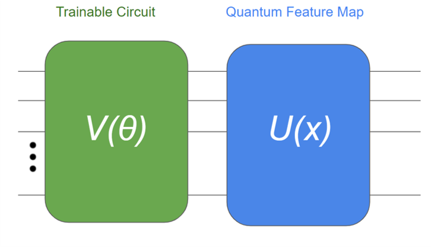
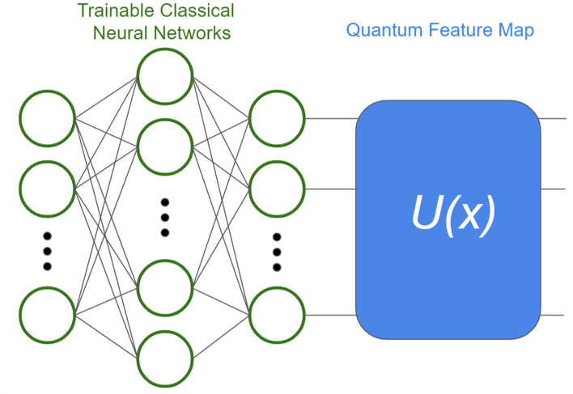
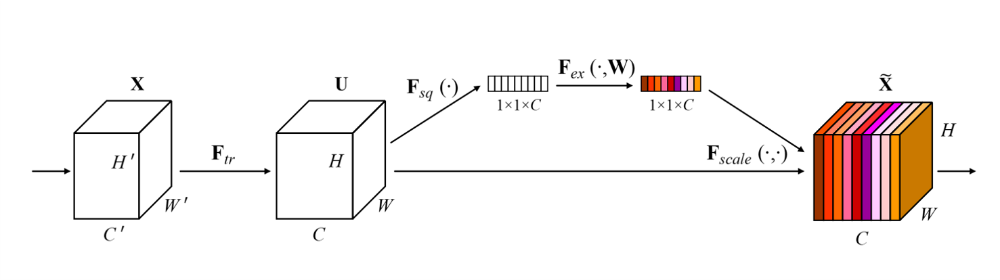
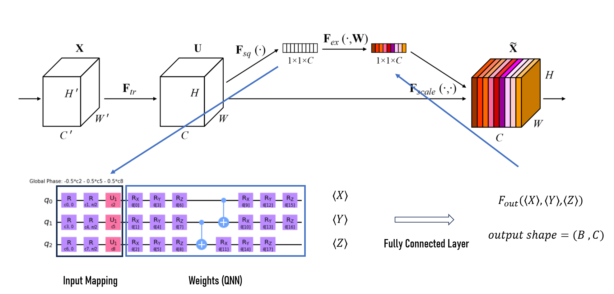

# Quantum-Machine-Learning

## Quantum Kernel Optimization with Classical Machine Learning 

<table>
  <tr>
    <td align="center"> </td>
    <td align="center"> </td>
  <tr>
</table>

## Quantumlized SE Layer
<table>
  <tr>
    <td align="center"> </td>
    <td align="center"> </td>
  <tr>
<table>

## Hardware usage

## Reference Paper
- [Pennylane](https://pennylane.ai/)
- [PyTorch Documentation](https://pytorch.org/docs/stable/index.html)
- [Transfer learning in hybrid classical-quantum neural networks](https://arxiv.org/abs/1912.08278)
- [QSVM](https://qiskit.org/documentation/stable/0.24/tutorials/machine_learning/01_qsvm_classification.html)
